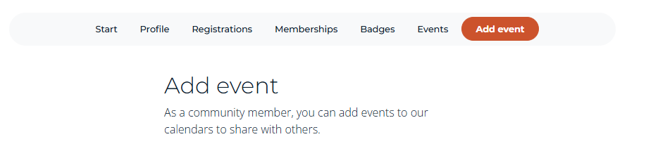
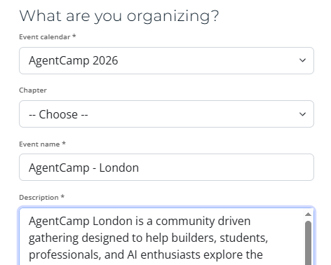
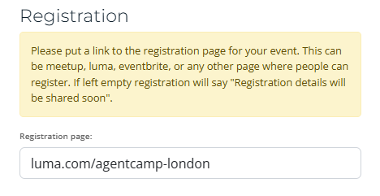
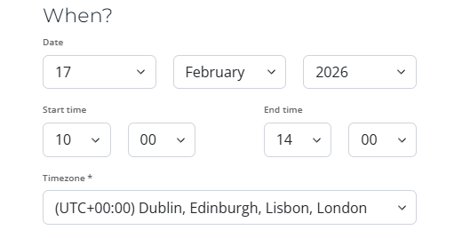
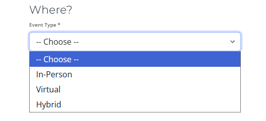
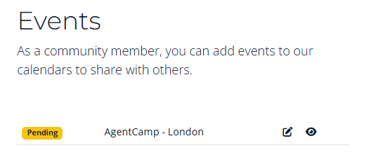

# Register

To register your event as part of AgentCamp 2026 follow the guidance below.

## Step 1 - Login:
- Login to with an existing account, or create a new account on [globalai.community](https://globalai.community)
- Navigate to: [https://globalai.community/my/add-event](https://globalai.community/my/add-event)

:::warning Are you an official Chapter?
Please login with your chapter email address or an account that is linked to your chapter.
:::

## Step 2 - What are you organizing
- Selected the agenda: AgentCamp 2026
- Chapter: If you are a chapter lead you can select your chapter else leave it empty.
- Name: Follow the guidance: AgentCamp - [Cityname], do not change the name the format of the name.
- Description: Enter a small description for the event. You can use **markdown** to format the description.

## Step 3 - Registration
- Enter the external link to the registration page, if you are a chapter lead you can opt-inn for "One-Click" registration. 

:::warning Are you an official Chapter?
One click registration will be available in the next weeks.
:::

## Step 4 - When
- Enter the date
- Enter the time, use the local time
- Set the timezone

## Step 5 - Where
- Select the event type 
- Fill out the details.

## Step 6 - Save
- Save the event
- After saving the event the event is submitted for review and will be published soon.

