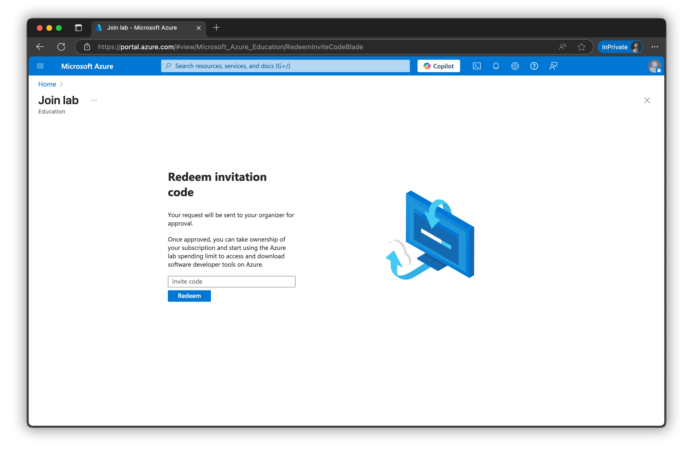
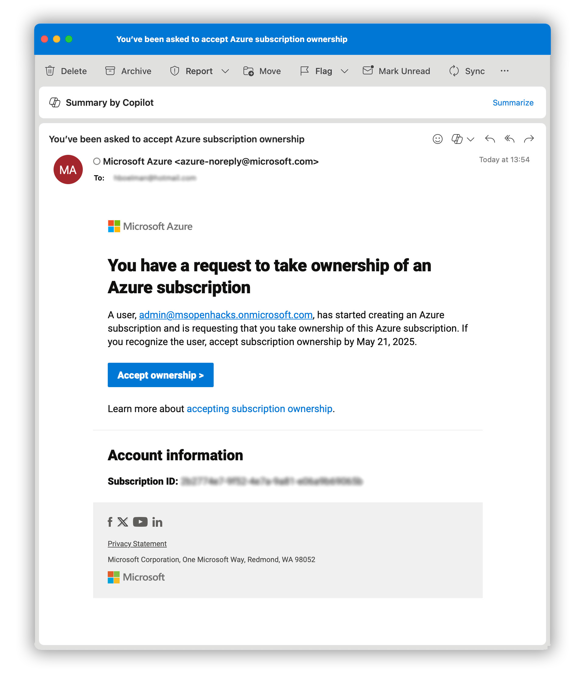
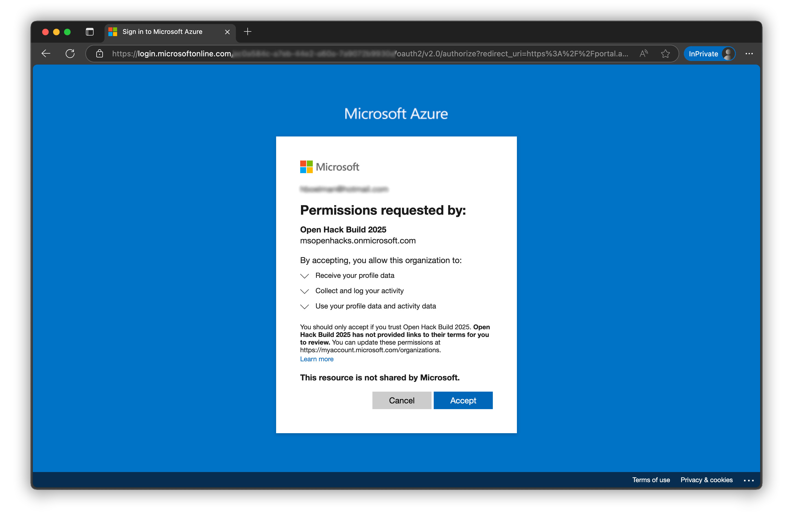
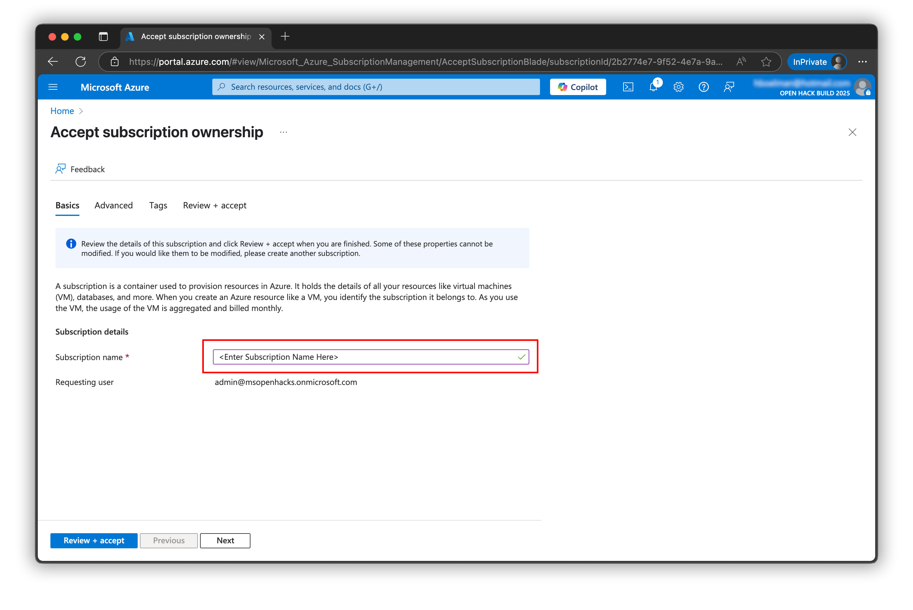
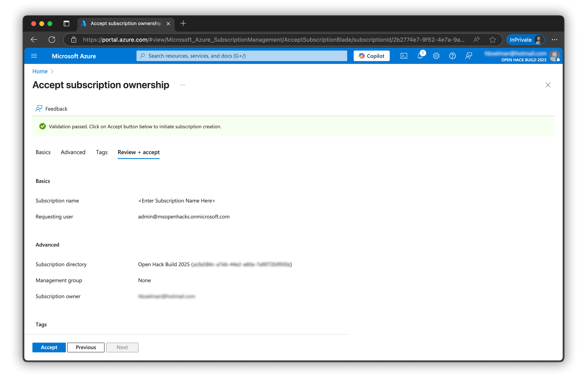
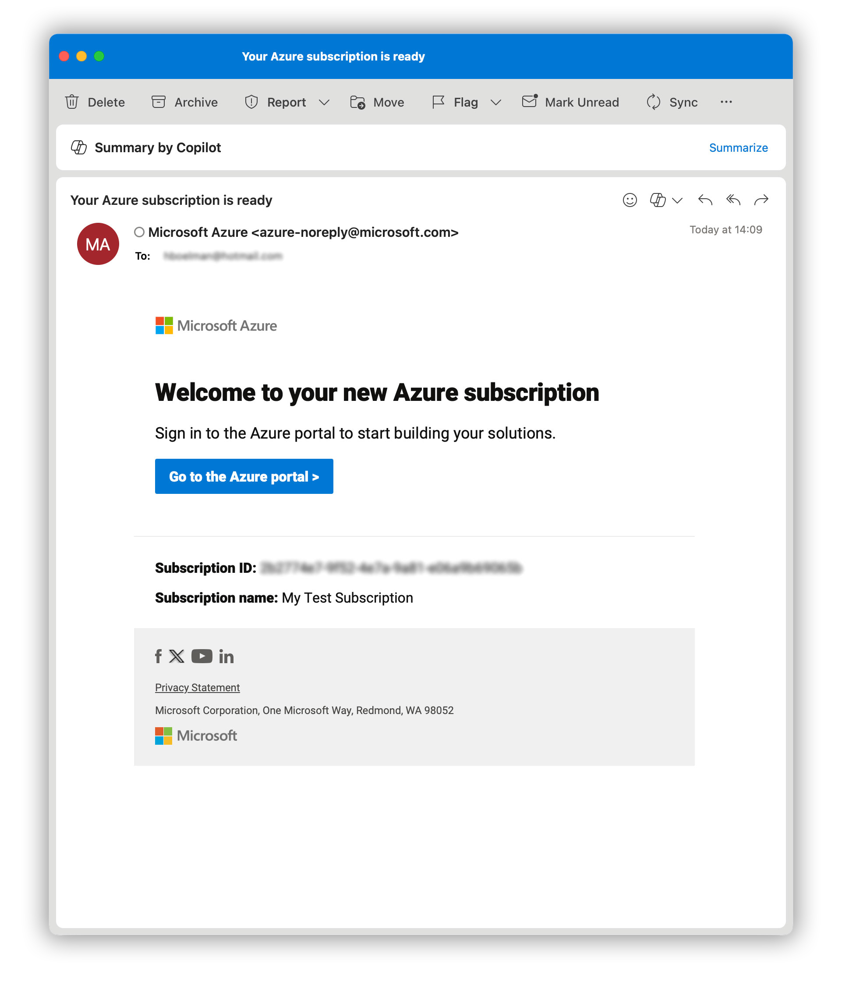
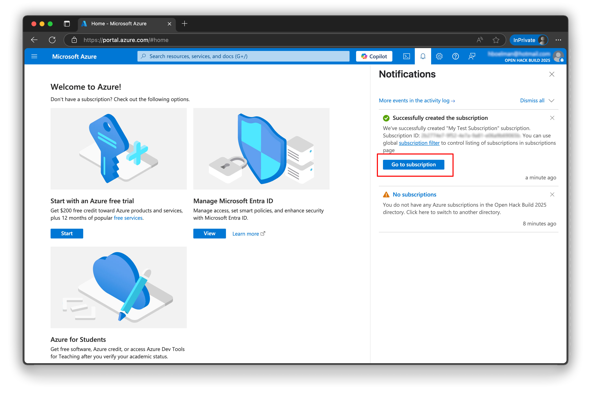

# Redeem an Azure Subscription

In case you do not have an Azure Subscription follow the guidance below to redeem a subscription.

## Step 1 - Request subscription
- Navigate to: [https://aka.ms/JoinEduLab](https://aka.ms/JoinEduLab)
- Sign in with a Microsoft or GitHub account

- Ask your event organizer for the `invite code`
- Enter the `invite code` and `click redeem`
- Wait for the email below to arrive

## Step 2 - Activate subscription
- Look out for the email below arriving in your mailbox.

- Click on the button `Accept Ownership`
- Login with the same account as in step 1

- After login, click `Accept` to login to the Open Hack tenant.

- You can use the suggested subscription name or create your own.
- Click `Review + Accept`

- Click `Accept`
- Your subscription is being created

## Step 3 - Happy hacking
- It can take a few minutes to create your subscription.

- When your subscription is ready you will get an email with subject: **Your Azure subscription is ready**

- You can also find the status of the subscription creation process under notifications.
- Click on "Go to subscription" in the notification or `Go to the Azure portal` in the email

Happy workshopping!

## Tips & Tricks

### Unable to find your subscription?
- Your subscription is created in the Tenant/Directory: "Global AI Community (gaicevents.onmicrosoft.com)"
- Sometimes you need to switch tenants, before you see the subscription. [Click here](https://portal.azure.com/#settings/directory) to switch Directory.
- Sometimes you need to adjust your [Subscription filter](https://portal.azure.com/#view/Microsoft_Azure_Billing/SubscriptionsBladeV2) for the subscription to show up.

### Video Walkthrough
You may also watch this video that walks you through the process.

<iframe width="560" height="315" src="https://www.youtube.com/embed/eZXMPoR0qKQ?si=aD2dVpD1VvtTCdHs" title="YouTube video player" frameborder="0" allow="accelerometer; autoplay; clipboard-write; encrypted-media; gyroscope; picture-in-picture; web-share" referrerpolicy="strict-origin-when-cross-origin" allowfullscreen></iframe>

