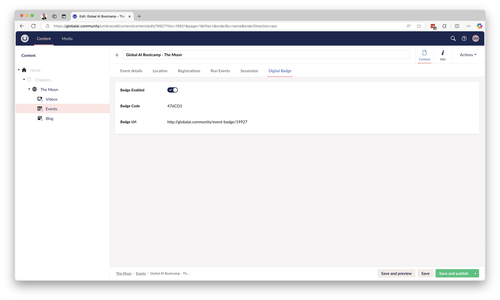

# Digital Badges

**Digital badges are designed to be awarded to your event attendees after they participate in your event.**

## How it works

- Login to your [Chapter Space](https://globalai.community/umbraco). 
- Navigate to Events
- Click on one of your events
- Navigate to the tab 'Digital Badge'
- Check Badge enabled
- Click Save and publish
- You can now see the link and code to be shared with the attendee.

