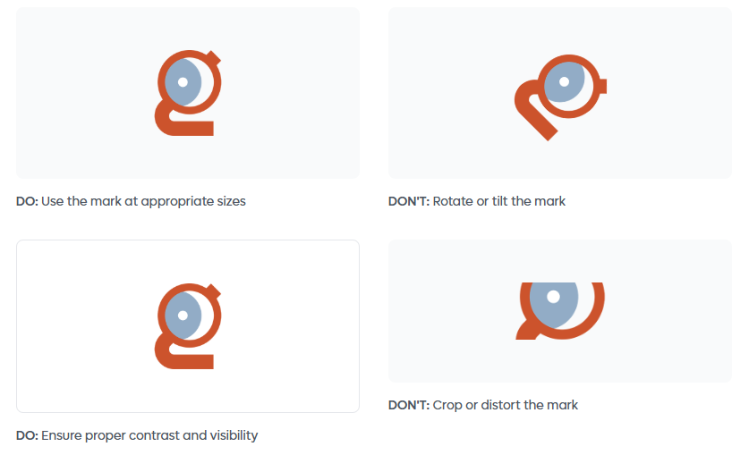
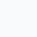

# Branding Assets and Design Guidelines

  

## Introduction

These guidelines are designed to help you understand and apply our brand identity consistently across all touchpoints. Our brand represents innovation, accessibility, and the transformative potential of artificial intelligence for the global community.

The elements outlined in these guidelines—from our logo to typography, colors, and visual language—work together to create a cohesive brand experience. These standards ensure that our community remains recognizable and maintains a professional presence across all platforms and mediums.

Please familiarize yourself with these guidelines and refer to them when creating materials that represent our global AI community. Consistency in our visual identity strengthens recognition and trust among our members and partners worldwide.

## Logo

Our community logo serves as our most recognizable symbol and should be used consistently across all applications. The logo has been carefully designed to reflect our mission and values while maintaining versatility across various media.

When using the logo, ensure it is clearly visible, uncluttered, and has adequate surrounding space. The logo should always be displayed in its original proportions—never stretch, compress, or alter the design in any way. For optimal legibility, maintain a minimum size as specified in these guidelines.

The logo is available in several formats for different applications. Use the full-color version on light backgrounds and the monochrome version when color reproduction is limited or for special applications.

[Download Logos](../public/logos/Global-AI-Community-Logos.zip)

### Logo Variations

| Version | Usage |
|---------|-------|
|  | [Full color version](../public/logos/global-AI-community.png)  |
|  | [White version for dark backgrounds](../public/logos/global-AI-community-white.png)  |
|  | [Semi-transparent version](../public/logos/global-AI-community-semi-white.png) |

### Do's and Don'ts: Logo Usage

## Mark

The Global AI mark is a standalone symbol that represents our community's identity. This iconic element can be used independently in situations where space is limited or as a brand recognition element across various touchpoints.

The mark embodies the essence of connectivity, global reach, and the transformative nature of artificial intelligence. It features a distinctive circular design that symbolizes inclusivity, continuous learning, and the interconnected global AI community.

When using the mark, ensure it maintains its visual integrity. The mark is available in full color and monochrome variations. Use the appropriate version based on the application and background to ensure maximum visibility and impact.

[Download Mark](../public/logos/Global-AI-Community-Mark.zip)

### Mark Display

| Version | Usage |
|---------|-------|
| [Full color mark](../public/logos/global-AI-mark-full-color.png) | Full color mark |
| [White mark](../public/logos/global-AI-mark-white.png) | White mark for dark backgrounds | 

::: info
### Usage Guidelines

- Maintain clear space around the mark equal to at least half its height
- Minimum size: 24px for digital, 0.5 inches for print
- Never alter the colors, proportions, or design elements
- Use on backgrounds that provide sufficient contrast
:::

### Do's and Don'ts: Mark

## Typography

Typography plays a key role in shaping our brand identity and ensuring clear, accessible communication. Our primary display typeface is **Lufga**, a modern geometric sans-serif that brings clarity, friendliness and a contemporary visual style to all Global AI materials.

Lufga offers excellent legibility at large sizes and a strong, confident character that aligns with our mission to make AI approachable for everyone.

For body content, we use **Montserrat**, a clean, versatile sans-serif optimized for readability across digital and print formats. This pairing creates a balanced, cohesive typographic system that feels modern, global and consistent.

Using our typography consistently helps maintain a unified brand experience across all touchpoints. Pay attention to hierarchy, spacing and sizing to keep content easy to read and visually well-structured.

| Version | Usage |
|---------|-------|
| [Lufga Font](/fonts/Lufga.zip) | Lufga |
| [Montserrat Font](/fonts/Montserrat.zip) | Montserrat |

---

### Typography Specifications

| Element      | Font        | Size | Weight            | Line Height |
|--------------|-------------|------|--------------------|-------------|
| Heading 1    | Lufga       | 60px | 800 (Extra Bold)   | 1.2         |
| Heading 2    | Lufga       | 48px | 700 (Bold)         | 1.2         |
| Heading 3    | Lufga       | 30px | 600 (Semi Bold)    | 1.3         |
| Body Text    | Montserrat  | 16px | 400 (Regular)      | 1.6         |
| Small Text   | Montserrat  | 14px | 400 (Regular)      | 1.5         |

> [!NOTE] 
>Use this guide for both digital and print designs to ensure consistency across the Global AI Community brand.

## Colors

Our color palette has been carefully selected to convey professionalism, innovation, and accessibility. These colors work together to create a harmonious visual system that supports our brand identity while ensuring excellent readability and accessibility across all applications.

Always use colors from this palette to maintain brand consistency. Test color combinations for sufficient contrast, especially for text and interactive elements, to ensure WCAG compliance and accessibility for all users.

### Primary Colors

| Brand Orange | Brand Blue | Navy | White |
|-------|-----|-------|-------|
|  #D2563C |  #94AEBB |  #2B3A4D |  #FFFFFF |

### Accent Colors

| Accent Blue | Success Green | Warning Amber | Error Red |
|-------|-----|---------|---------|
|  #2563EB |  #059669 |  #F59E0B |  #DC2626 |

### Gray Scale

| 50 | 100 | 200 | 400 | 600 | 900 |  
|-------|-------|------|-------|-------|-------|
|  #F9FAFB |  #F3F4F6 |  #E5E7EB |  #9CA3AF |  #4B5563 |  #111827 |
| Very light backgrounds | Light backgrounds | Borders and dividers | Disabled states | Secondary text | Primary text and headings |

::: info
### Color Usage Guidelines

- Use Primary Black for headlines and body text on light backgrounds
- Maintain a minimum contrast ratio of 4.5:1 for normal text and 3:1 for large text
- Use accent colors sparingly to highlight important actions and information
- Apply semantic colors (success, warning, error) consistently across all interfaces
- Use the gray scale for subtle backgrounds, borders, and secondary information
:::

## Questions & Support

For questions about these guidelines or to request additional brand assets, please contact our brand team.
